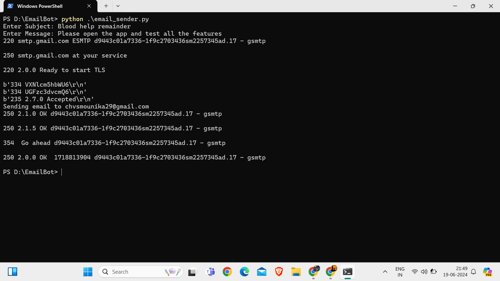

# BloodHelp Email Reminder Bot

## Table of Contents
1. [Introduction](#introduction)
2. [Problem Statement](#problem-statement)
3. [Solution](#solution)
4. [Features](#features)
5. [Prerequisites](#prerequisites)
6. [Enable SMTP access](#access)
7. [Installation](#installation)
8. [Configuration](#configuration)
9. [Usage](#usage)
10. [Code description](#description)
11. [Screenshots](#screenshots)

---

## Introduction
BloodHelp is a platform dedicated to connecting blood donors with recipients efficiently. 

---

## Problem Statement
In closed testing phase , I have to send bulk remainders to all the testers to test the app. As it has been made compulsary for all new developer accounts to go through the phase of closed testing. 

---

## Solution
This Bot uses SMTP protocols from scratch and sends emails to the testers. The efficiency of the bot is increased to 70% by using multi threading and batch techiniques. Used Tenacity to handle transient failures.

---

## Features
- **Automated Email Reminders:** Sends scheduled reminder emails to donors.
- **Integration with Excel:** Reads contact information from an Excel file.
- **SMTP Authentication:** Uses secure authentication to send emails.
- **Error Handling:** Catches and displays errors during the email sending process.

---


### Prerequisites
- Python 3.x
- pandas
- An email server (SMTP)
- An Excel file with contact information
  
---
### access
-Make sure SMTP access is enabled for your email account. For Gmail users, this typically involves allowing "less secure apps" or setting up an App Password if 2-Step Verification is enabled. 

---
### Installation
1. Clone the repository:
   ```bash
   git clone https://github.com/yourusername/BloodHelp-email-bot.git
2. Navigate to project directory
   ```bash
   cd BloodHelp-email-bot
3. Install the required packages:
   ```bash
   pip install pandas

---

### Configuration
1. Open the Python script and update the email server settings and user credentials:
  -userEmail = "useremail@gmail.com"
  -userPassword = "password"
  -mailserver = 'smtp.gmail.com'
2. Ensure that your Excel file with contact information is named contacts.xlsx and is placed in the same directory as the script.

---

### Usage
1. Run the script
   ```bash
   python email_bot.py
2. Enter the subject and body of the email when prompted.
3. The bot will read the contact information from contacts.xlsx and send emails accordingly.

---
### screenshots


---
### description
1. Establishing Connection and Sending Emails
   The script establishes a connection to the SMTP server, performs the necessary authentication, and iterates through each contact to send emails.
   ```bash
   try:
     clientSocket = socket.socket(socket.AF_INET, socket.SOCK_STREAM)
     clientSocket.connect((mailserver, 587))  # 587 is the default port for SMTP with TLS/STARTTLS

     recv = clientSocket.recv(1024).decode()
     print(recv)
     if recv[:3] != '220':
        print('220 reply not received from server.')

     heloCommand = 'HELO Alice\r\n'
     clientSocket.send(heloCommand.encode())
     recv1 = clientSocket.recv(1024).decode()
     print(recv1)
     if recv1[:3] != '250':
        print('250 reply not received from server.')

     clientSocket.send("STARTTLS\r\n".encode())
     recv2 = clientSocket.recv(1024).decode()
     print(recv2)
    
    # Create SSL context and wrap the socket
     context = ssl.create_default_context()
     sslClientSocket = context.wrap_socket(clientSocket, server_hostname=mailserver)

     sslClientSocket.send("AUTH LOGIN\r\n".encode())
     print(sslClientSocket.recv(1024))
     sslClientSocket.send(b64encode(userEmail.encode()) + "\r\n".encode())
     print(sslClientSocket.recv(1024))
     sslClientSocket.send(b64encode(userPassword.encode()) + "\r\n".encode())
     print(sslClientSocket.recv(1024))

    # Loop through each contact and send the email
     for index, contact in contacts.iterrows():
        userDestinationEmail = contact['Email']
        print(f"Sending email to {userDestinationEmail}")
        try:
            send_email(sslClientSocket, userDestinationEmail, userSubject, msg)
        except Exception as e:
            print(f"Failed to send email to {userDestinationEmail}. Error: {e}")

     quitCommand = "QUIT\r\n"
     sslClientSocket.send(quitCommand.encode())
     recv5 = sslClientSocket.recv(1024).decode()
     print(recv5)
     sslClientSocket.close()
   
  except Exception as e:
    print(f"An error occurred: {e}")
- Socket Connection: Establishes a connection to the SMTP server on port 587.
- HELO Command: Sends the HELO command to the server.
- STARTTLS: Upgrades the connection to use TLS.
- SSL Context: Wraps the socket with SSL for secure communication.
- Authentication: Sends the AUTH LOGIN command followed by the base64-encoded email and password for authentication.
- Email Loop: Iterates through each contact in the Excel file and calls send_email to send the email.
- QUIT Command: Sends the QUIT command to terminate the connection.

2. Function to Send Email
   - The send_email function handles the process of sending an email to a single recipient.
  ```python
    def send_email(sslClientSocket, userDestinationEmail, userSubject, msg):
      mailFromCommand = f"MAIL FROM: <{userEmail}>\r\n"
      sslClientSocket.send(mailFromCommand.encode())
      recv2 = sslClientSocket.recv(1024).decode()
      print(recv2)

      rcptToCommand = f"RCPT TO: <{userDestinationEmail}>\r\n"
      sslClientSocket.send(rcptToCommand.encode())
      recv3 = sslClientSocket.recv(1024).decode()
      print(recv3)

      dataCommand = "DATA\r\n"
      sslClientSocket.send(dataCommand.encode())
      recv4 = sslClientSocket.recv(1024).decode()
      print(recv4)

      sslClientSocket.send(f"Subject: {userSubject}\r\n\r\n{msg}\r\n.\r\n".encode())
  ```

3. ------------------
- mailFromCommand: Sends the MAIL FROM command to the SMTP server.
- rcptToCommand: Sends the RCPT TO command to specify the recipient's email address.
- dataCommand: Initiates the transfer of the email data.
- Email Content: Sends the subject and body of the email.

---

